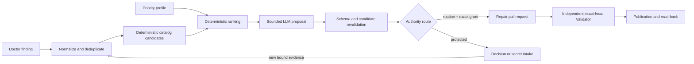

# Governed skills architecture

## Scope and composition

This standard owns portable, data-only skill definitions, catalog indexes,
candidate-bound LLM selection documents and exact execution handoffs. It
answers four questions:

1. Which stable diagnostics make a skill eligible?
2. Which agent phases exchange which bounded artifacts?
3. Which authority bindings and validation criteria are required?
4. Which findings may be routine candidates and which require a protected
   decision route?

It does not own agent identities, execution, grant issuance or verification,
task state, priority policy or merge authority. Its grant-binding document is
only an inert projection of authority issued and verified elsewhere. Those
responsibilities remain composed:

- `wellmanifest/agent` owns Doctor, Repair, Validator, Skills and other role
  boundaries; only Repair may mutate and only through a pull request.
- `wellmanifest/priority` owns deterministic priority inputs and ranking.
- `wellmanifest/policy-dsl` may propose policy decisions but grants no effect.
- `wellmanifest/poa` compiles an accepted request into an exact plan, grant and
  receipt boundary.
- `wellmanifest/repair-lifecycle` owns diagnosis, separate repair authority,
  isolated execution, independent validation, publication and read-back.
- `wellmanifest/logs` owns append-only operational evidence.
- `wellmanifest/new-project`, `ticket-lifecycle` and `git-lifecycle` own the
  governed repository and delivery process.

Wellmanifest is `HOME` for this domain pack. Product CLIs, daemons and agents
remain `HOME subactor` or another runtime organization and `ADOPT
wellmanifest/skills`; adoption never moves their runtime into Wellmanifest.

## Normative flow

Doctor evidence must already contain a stable diagnostic code, deterministic
fingerprint, severity, error class, retryability, exact target identity and
redacted bounded evidence. A query result or severity never creates authority.

The skills orchestrator resolves only definitions whose diagnostic match and
catalog digest are valid. It deduplicates on `(targetRepository, fingerprint)`,
derives a baseline from the pinned priority profile and gives an LLM only the
precomputed eligible skill IDs. The model may return a bounded priority
adjustment and rationale. It cannot add a target, candidate, capability,
authority, transport or command. The controller rejects proposals that escape
the request and recomputes every digest before further planning.

An accepted selection is still not an execution plan or grant. POA and the
repair lifecycle must bind the finding, target, exact base SHA, catalog,
definition, policy or decision and final plan digest. Repair consumes that
external authority in an isolated workspace. Validator uses a distinct
identity and the exact pull-request head. Publication succeeds only after
trusted exact-head validation and independent read-back.

The companion `skill-execution/v1` handoff family makes that composition
machine-checkable without moving authority here. It contains four closed
documents:

- an inert plan for one stable operation ID and one exact repository;
- a single-use external grant binding that must match every plan digest and
  target binding;
- a terminal receipt with independent validation, rollback state and EQL
  read-back;
- a structured error envelope that resolves to the closed canonical error
  registry.

Repository bootstrap binds expected absence plus an exact desired-state digest
instead of inventing a base SHA. Every operation on an existing repository
binds its exact base SHA. Validation is represented by registered check IDs;
the standard never carries shell or argv. The six stable operations are
`repository:bootstrap`, `repository:register-mirror`,
`repository:profile-validate`, `repository:profile-apply`,
`repository:repair` and `repository:update`.

## Normative invariants

1. Every object is closed; unknown fields fail validation.
2. Every catalog entry makes its skill definition immutable through repository,
   40-character revision, relative path and SHA-256 digest. The adopting
   profile pins the catalog itself; documents never self-reference their own
   not-yet-existing commit.
3. A catalog defaults to `block`; no fuzzy or LLM-only fallback is allowed.
4. Diagnostic selection is deterministic before an LLM sees any candidate.
5. The LLM authority is always `propose-only`; output is constrained by the
   request-only grammar and revalidated against the request candidate set.
6. Skill data cannot carry shell, argv, a command, a remote URL, transport,
   credential value, secret, bearer grant or merge instruction.
7. Every authority route binds at least finding, target repository, catalog and
   skill digests. Standing policy also binds its policy digest. Pull-request
   mutation additionally binds the exact base SHA.
8. Only a `repair-agent` operation may declare `pull-request`; it must include
   both Repair and independent Validator phase contracts.
9. An operation with `effect=none` changes zero repository files.
10. Missing, stale, ambiguous or mismatched evidence results in `block`,
    `escalate` or `plan-only`, never inferred authority.
11. A finding remains open until a terminal receipt proves either successful
    validation/read-back or an explicit, durable decision outcome. Merely
    creating a ticket is not a repair.
12. Agent-specific prose in `SKILL.md` explains use; `skill.json` is the
    machine contract. A script is an implementation aid, not authority.
13. An effect request remains inert until an external, unexpired, single-use
    grant binds the complete plan; the binding never contains bearer material.
14. A successful pull-request receipt binds independent Validator evidence to
    its exact head and requires satisfied EQL read-back.
15. Failure output uses a registered error code and exact canonical error
    reference; free-form errors cannot become control input.

## Protected safety classes

The standard makes difficult findings actionable without silently deciding for
the operator:

| Safety class | Required route | Required behavior |
| --- | --- | --- |
| `routine` | `standing-policy` or `digest-bound` | May proceed only with all exact bindings and the declared Repair/Validator lifecycle. |
| `stash` | `human-decision` | Preserve workspace state and request a bounded choice; never pop, apply, drop, commit or discard automatically. |
| `license` | `human-decision` | Present detected package/repository facts and allowed policy choices; never infer a license or legal owner. |
| `secret` | `secret-intake` | Keep values outside LLM, plans and receipts; request an exact external metadata reference through the authorized intake boundary. |
| `ambiguous` | `human-decision` | Present the conflicting interpretations, affected paths and proposed scopes; resume only from a bound decision. |
| `destructive` | `human-decision` | The skill remains non-mutating; a distinct explicitly authorized process must own any irreversible effect. |

Protected routes are not dead ends. Each produces a redacted decision request
with the exact finding and candidate digest, and a later answer becomes new
evidence that restarts deterministic selection. That provides autonomous
continuation after a decision without pretending the model made the decision.

## Trust boundaries

| Boundary | Owns | Must reject |
| --- | --- | --- |
| Diagnostic registry | Stable code, fingerprint and error class | Free-form findings without target identity |
| Skill definition | Typed phases, capability, risk and required bindings | Executable commands or self-issued authority |
| Skill catalog | Immutable definition index and default block | Moving revisions, duplicate IDs or fuzzy fallback |
| Priority engine | Deterministic baseline | LLM-created priority policy |
| LLM selector | Candidate choice, bounded adjustment and rationale | New targets, candidates, authority or transport |
| Skills orchestrator | Revalidation, dedupe and handoff | Replacing Doctor, Repair or Validator execution |
| Authority controller | Exact grant and read-back | Treating a finding, skill or proposal as authority |
| Repair agent | Isolated pull-request mutation | Direct default-branch or local-user-state mutation |
| Validator agent | Independent exact-head evidence | Self-review, stale head or model verdict as approval |

## Versioning

Changes that add fields or accepted enum values create a new document version.
Existing definitions and catalogs remain immutable at their original commit and
digest. The public schema URL is an identifier, not a runtime dependency;
adopters validate a local copy pinned by repository revision and digest.
